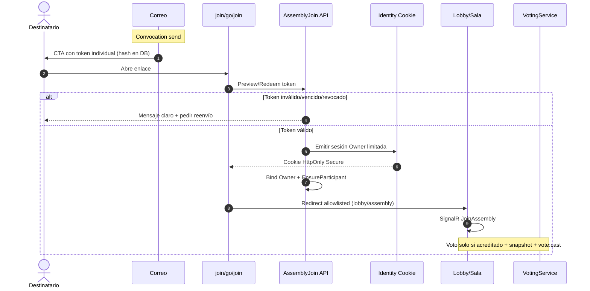

# ASAMBLEAS — Diagnóstico: votación en vivo y acceso desde convocatoria

**Fecha:** 2026-09-03 (ejecución local 2026-09-04 UTC)  
**Alcance:** `https://localhost:7188` (Development)  
**Modo:** solo análisis — sin correcciones, migraciones, commits ni despliegue VPS  
**Asamblea de prueba:** `44444444-4444-4444-4444-444444444401` (PH DEMO OCEAN TOWER)

---

## 1. Resumen ejecutivo

La **capa de dominio/API de votación formal funciona** para propietarios acreditados con permiso `vote:cast`: apertura, SignalR, elegibilidad, cast, anti-duplicado y rechazo al presidente están verificados en ejecución.

Lo que perciben los usuarios como “no puedo votar” en la sala en vivo es, en la evidencia actual, un **fallo de interfaz / composición del panel `#vote-panel`**:

1. El **cuestionario en vivo** se inserta **encima** de la UI de voto.
2. Con muchas mociones, el panel queda con `max-height ≈ 288px` y `scrollHeight ≫ clientHeight`, de modo que las opciones **A favor / En contra / Abstención** quedan **fuera del viewport** del rail.
3. El cuestionario usa **texto claro** (`rgb(232, 238, 248)`) sobre **fondo claro**, casi ilegible — refuerza la sensación de panel “vacío” o “roto”.
4. El encabezado sí muestra **VOTACIÓN ABIERTA**, lo que confirma estado de negocio correcto y UI de cast oculta/ilegible.

El acceso por correo de convocatoria **ya emite un token individual hasheado** (`/join.html?token=…`), pero **no es passwordless**: el claim exige cookie de sesión y contraseña (o cuenta previa). No existe enlace mágico que cree sesión autenticada limitada.

---

## 2. Estado actual de ambos flujos

### Votación en vivo

| Capa | Estado |
|------|--------|
| Dominio Motion → Present → VotingSession Open → Cast → Close | Operativo |
| API `VotingController` + `VotingService` | Operativo (con reglas estrictas de acreditación/snapshot) |
| SignalR `votingOpened` / hub `assembly:{id}` | Operativo (badge y `data-voting=open` en cliente) |
| UI cast en `#vote-panel` | **Funciona parcialmente**: controles existen en DOM pero quedan bajo el cuestionario + contraste pobre |
| Presidente / operador | **No puede emitir voto** (diseño: sin `vote:cast`) |

### Acceso desde convocatoria

| Capa | Estado |
|------|--------|
| Emisión de `AssemblyAccessLink` por destinatario | Existe |
| URL en correo | `{PublicBaseUrl}/join.html?token={opaque}` |
| Preview anónimo | Existe |
| Claim | Requiere `[Authorize]` + match email/UserId |
| Sesión passwordless | **No existe** |
| Uso único del token | **No** (reutilizable hasta expiry/revoke) |

---

## 3. Pasos exactos de reproducción

### Entorno

1. PostgreSQL local en `127.0.0.1:5432` (DB `asambleas`).
2. App: `dotnet run` en `src/Asambleas.Web` → `https://localhost:7188` (`ASAMBLEAS_APPLY_MIGRATIONS=false`, `Demo__SeedUsers=false` en esta sesión de diagnóstico).
3. Credenciales demo vía `.demo-password.local` (no se reproducen aquí).
4. Sesiones aisladas: contextos Playwright separados + cookies PowerShell independientes.

### Flujo A — votación

1. Login `president@ocean.demo` y `owner101@ocean.demo` / `owner104@ocean.demo` en contextos distintos.
2. Asamblea Ocean en `InProgress`.
3. Cerrar sesión de voto previa si existía.
4. Presidente: crear moción (`DIAG-…`), publish, `POST .../motions/present`, `POST .../voting/open`.
5. Propietario en `assembly.html` (otra sesión).
6. Observar badge **VOTACIÓN ABIERTA**, DOM de `#vote-panel`, intento de cast API y UI.
7. Artefactos: `artifacts/diag-vote/results.json`, `owner-after-open.png`, `owner104-scrolled.png`, `dom-probe.json`.

### Flujo B — join

1. `GET /api/join/preview?token=deadbeef` → `valid:false`, `INVALID_OR_EXPIRED`.
2. `POST /api/join/claim` sin cookie → **401**.
3. Revisión de código de emisión/claim (sin reenvío real de correo en esta pasada).

---

## 4. Causa raíz confirmada (por qué “no pueden votar”)

### Causa raíz confirmada (UX / composición del panel)

**Los controles de voto sí se renderizan, pero el usuario no los ve de forma usable** porque:

1. `refreshPanels()` en `room-app.js` llama primero `renderVotePanel(#vote-panel)` y después `liveWorkspace.renderQuestionnaire(#vote-panel)`, que hace **`root.prepend(host)`** del cuestionario.
2. Con prioridad `data-priority="voting"`, CSS limita `#vote-panel` a `max-height: min(42vh, 18rem)` (~288px observados) con scroll interno.
3. Con ~16 mociones activas, el cuestionario ocupa ~1230px de scroll; las choice cards quedan **abajo**.
4. Estilos del cuestionario / sección dorada usan texto del tema oscuro sobre fondo claro → contraste fallido.

**Evidencia de ejecución (owner104, voto abierto, aún no votado):**

- `data-voting=open`, `data-priority=voting`, `data-role=owner`
- Hijos de `#vote-panel`: `[live-questionnaire]`, `[vote-live-header]`, `[vote-participation]`, `[choice-cards]` (3), `[vote-confirm-row]`
- `questionnaireColor: rgb(232, 238, 248)` sobre fondo claro
- `choiceCardCount: 3` (existen); no visibles sin scroll

**Resultado esperado:** al abrir votación, el propietario debe ver de inmediato opciones y confirmar.  
**Resultado actual:** ve (casi ilegible) el cuestionario; el cast está debajo del fold del rail.

### No es causa raíz (contraevidencia)

El backend **sí acepta** el voto del propietario elegible:

- `GET .../my-status` → `ELIGIBLE` (coef 14%, unidad 101)
- `POST .../cast` → **200** con `voteId` / `evidenceId`
- Duplicado distinto → **400** `Double vote is not allowed…`
- Presidente → **403** sin `vote:cast`

Por tanto: “no funciona votar” en el sentido de **persistencia/API** está **refutado** para owners acreditados en Ocean; el problema observable en sala es **UI**.

---

## 5. Evidencias (código + ejecución)

### Archivos / métodos clave

| Pieza | Ruta | Método / regla |
|-------|------|----------------|
| UI sala | `src/Asambleas.Web/wwwroot/js/modules/room-app.js` | `refreshPanels` ~1662–1764: `renderVotePanel` luego `renderQuestionnaire` |
| Cuestionario | `.../live-voting-workspace.js` | `renderQuestionnaire` — `root.prepend(host)` |
| Cast UI | `.../voting.js` | `renderVotePanel` — choice cards si `canCast && session.status==="Open"` |
| CSS clip | `.../css/assembly-room.css` | `.room[data-priority="voting"] .sidebar #vote-panel { max-height: min(42vh, 18rem) }` |
| CSS contraste | `.../css/live-voting.css` | `.live-questionnaire` fondo claro; hereda `--text-primary` claro |
| Apertura | `Asambleas.Application/Voting/VotingService.cs` | `OpenSessionAsync` — solo `InProgress`; motion `Presented`; freeze eligibility |
| Cast | mismo | `CastVoteAsync` — acreditación + snapshot; no confía coeficiente del cliente |
| Elegibilidad | mismo | `BuildEligibilityAsync` — `IsAccredited` y no `Registered`/`Left` |
| Permisos | `RolePermissionMap.cs` | `Owner` tiene `vote:cast`; `AssemblyPresident` **no** |
| Hub | `Asambleas.Web/Hubs/AssemblyHub.cs` | `JoinAssembly` → grupo `assembly:{id}` |
| Eventos | `votingOpened` handler en `room-app.js` | setea `state.session` + `refreshPanels` |
| Join | `AssemblyAccessLinkService.cs` | `IssueAsync` / `ClaimAsync` |
| Join API | `AssemblyJoinController.cs` | preview AllowAnonymous; claim Authorize |
| FE join | `wwwroot/js/modules/join-app.js` | redirige a login con `returnUrl` si no autenticado |

### Respuestas HTTP observadas

| Actor | Acción | Código | Detalle |
|-------|--------|--------|---------|
| owner101 | cast (sesión abierta, ELIGIBLE) | 200 | voto persistido |
| owner102/103 | cast | 200 | |
| president | cast | 403 | Sin permiso (`vote:cast`) |
| owner | duplicate choice distinta | 400 | ALREADY_VOTED / double vote |
| anónimo | join/claim | 401 | |
| anónimo | join/preview token inválido | 200 | `valid:false` |

### Roster (asistencia)

Participantes Ocean (API `attendance/participants`): owners acreditados `CheckedIn`/`TemporarilyDisconnected` con coeficiente; presidente `IsAccredited=false` (sin derecho de cast de todas formas).

---

## 6. Clasificación de hallazgos

| Hallazgo | Tipo |
|----------|------|
| Controles de voto debajo del cuestionario + max-height del panel | **Causa raíz confirmada** (UX bloqueante) |
| Texto claro sobre fondo claro en cuestionario/sección voting | **Defecto visual confirmado** (contribuye) |
| Presidente sin `vote:cast` | **Diseño confirmado** (puede confundir si se prueba con cuenta mesa) |
| Cast rechazado si no acreditado / fuera del snapshot al abrir | **Causa contribuyente** (regla de negocio correcta; mal comunicada en UI) |
| UI gatea solo con `vote:cast`, no con `myStatus` NOT_ELIGIBLE | **Causa contribuyente** (botones posibles + error API) |
| SignalR “no empuja la votación” | **Hipótesis no confirmada** — en repro, `data-voting=open` y DOM de cast presentes |
| Fallo multitenant / filtro PH en cast | **Hipótesis no confirmada** en Ocean (cast 200) |
| “Borrador impide votar” confundido con DesignStatus vs session Open | Posible confusión de producto; formal open crea sesión `Open` directamente |

---

## 7. Tabla del recorrido completo del voto

| Etapa | Qué ocurre | Evidencia |
|-------|------------|-----------|
| **Interfaz (mesa)** | Crear/presentar moción; abrir votación (API o workspace) | `MotionsController`, `VotingController.Open`, live-voting-workspace |
| **Evento / petición** | `POST /api/assemblies/{id}/voting/open` | 200 + `VotingSessionDto` status `Open` |
| **Publicación realtime** | `votingOpened` a grupo `assembly:{guid}` | Handler `room-app.js` |
| **Interfaz (propietario)** | `renderVotePanel` + prepend cuestionario | DOM: choice-cards tras cuestionario |
| **Petición cast** | `POST .../voting/{sessionId}/cast` + antiforgery cookie | 200 si elegible |
| **Controlador** | `VotingController.Cast` policy `vote:cast` | 403 si presidente |
| **Servicio** | `VotingService.CastVoteAsync` | validaciones asistencia/snapshot/idempotencia |
| **Validación** | Open session; accredited; snapshot; choice; no double | DomainException + códigos VotingCodes |
| **Base de datos** | `Vote` + evidence; tallies | respuesta con `voteId`/`evidenceId` |
| **Resultado** | `voteTallyUpdated` / close → `votingClosed` | presidente ve progreso; owner con HiddenUntilClose no ve breakdown |

---

## 8. Análisis del flujo actual de convocatorias

```text
Create Convocation → recipients (owners PH)
  → Send/Resend → CommunicationBatch/Deliveries
  → DeliveryDispatchService.SendOneAsync (email)
      → AssemblyAccessLinkService.IssueAsync (revoca prior, hash SHA-256, URL join)
      → ConvocationEmailComposer CTA “Acceder a la asamblea”
  → Email

Click → join.html?token=
  → GET /api/join/preview (anon)
  → si no sesión: /?returnUrl=/join.html?token=…
  → POST /api/join/claim [Authorize]
      → match email/UserId → EnsureParticipant → redirect lobby|owner
```

- **ICS/calendario** puede anunciar `/lobby.html?assemblyId=` **sin token** (superficie más débil, distinta del mail).
- Onboarding de cuenta (`/activate.html`) es **otro** token (owner invitation, single-use 48h), no el join de convocatoria.

---

## 9. Riesgos del acceso actual

| Riesgo | Severidad | Notas |
|--------|-----------|-------|
| Obliga contraseña → fricción alta para no técnicos | Alta (producto) | Cumple seguridad parcial, falla UX requerida |
| Token multi-uso hasta expiry (hasta schedule+2d o 14d) | Media | Reenvío de correo = acceso compartible |
| Token en query string | Media | Historial/Referer; middleware lo permite en join |
| Preview anónimo revela título/PH/horario | Baja–Media | Informativo sin auth |
| Claim no firma sesión; solo enrola | — | Passwordless requiere cambio de auth |
| ICS sin token | Media | Bypass del modelo “invitación individual” |

---

## 10. Diseño propuesto: enlace mágico individual

### Objetivos

1. CTA “Ingresar a la asamblea” → validación automática → lobby/sala.
2. Sin pedir usuario/contraseña en el camino feliz.
3. Identidad = destinatario concreto (Owner/Recipient), permisos de Owner únicamente.
4. No enlace público de asamblea; no desactivar auth global.

### Mecánica propuesta

| Elemento | Diseño |
|----------|--------|
| Token | 32+ bytes CSPRNG, base64url; **solo hash** en DB (como hoy) |
| Alcance | `TenantId + PropertyHorizontalId + AssemblyId + RecipientId (+ OwnerId)` |
| TTL | Corto operativo (p.ej. 72h o hasta `ScheduledAt+1d`, el menor) + reloj de reingreso |
| Estados | Issued → Redeemed / Revoked / Expired / Superseded |
| Consumo | Primera redención crea/renueva sesión cookie; política explícita de **reingreso** (ver abajo) |
| Sesión | Cookie `asambleas.auth` HttpOnly Secure SameSite=Lax; claims Owner + tenant/PH; **sin** permisos de mesa |
| Path | Preferir `/go/join/{token}` (path) vs query para reducir fuga Referer |
| Rate limit | Por IP + por hash de token en preview/redeem |
| Auditoría | ISSUE / PREVIEW / REDEEM_OK / REDEEM_FAIL / REVOKE / RESEND |
| Reenvío correo | Revoca familia anterior (ya casi así) + nuevo token |
| Cancel asamblea | Revoca todos los links de la convocatoria/asamblea |
| Open redirect | Allowlist de paths internos (`/lobby.html`, `/owner.html`, `/assembly.html`) con `assemblyId` del link |

### Reenvío del correo (equilibrio)

- **No** single-device absoluto (rompe UX no técnica).
- **Sí:** TTL corto, revocación al reenviar, auditoría de cada redeem, aviso en UI “este acceso es personal”, opcional challenge suave tras N dispositivos distintos (email OTP) **solo** si hay abuso.
- Reingreso tras F5: permitido mientras cookie viva **o** token aún no expirado (documentar: “multi-use acotado”, no anónimo).

### Relación con votación / quórum

El magic link **solo autentica e inscribe** `AssemblyParticipant`.  
Derecho a voto sigue dependiendo de:

- check-in / acreditación,
- snapshot al abrir la sesión,
- representaciones/coeficiente,
- permiso `vote:cast`.

Entrar a la sala ≠ poder votar.

---

## 11. Diagrama Mermaid — acceso desde correo



---

## 12. Archivos a modificar (implementación futura)

### Votación UI (P0)

- `wwwroot/js/modules/room-app.js`
- `wwwroot/js/modules/live-voting-workspace.js`
- `wwwroot/js/modules/voting.js` (opcional: priorizar cast UI)
- `wwwroot/css/assembly-room.css`
- `wwwroot/css/live-voting.css`
- `wwwroot/css/components.css` (choice-cards contraste si aplica)
- E2E: `tools/e2e/live-assembly-realtime-e2e.cjs` (+ asserts de contraste/scroll)

### Magic link

- `AssemblyAccessLinkService.cs` / entidad `AssemblyAccessLink`
- `AssemblyJoinController.cs`, posiblemente `AuthController` / sign-in helper
- `CredentialQueryGuardMiddleware.cs`
- `DeliveryDispatchService.cs` / `ConvocationEmailComposer`
- `join.html` + `join-app.js` (+ activación encadenada)
- `CalendarSchedulingService.cs` (no anunciar lobby sin token)
- Migración EF (campos consume/familia)
- Contratos Communications + auditoría

---

## 13. Posibles cambios de modelo / DB (sin ejecutar)

| Cambio | Motivo |
|--------|--------|
| `ConsumedAtUtc`, `ConsumedByUserId` (o `RedeemCount` + `MaxRedeems`) | Política de uso |
| `TokenFamilyId` / `SupersededByLinkId` | Rotación en reenvío |
| `LastRedeemIpHash` / `UserAgentHash` (opc.) | Detección abuso sin PII cruda |
| Índice por `(AssemblyId, RecipientId, RevokedAtUtc)` | Operaciones |
| Tabla `AccessLinkAudit` o reuse audit trail | Compliance |

Votación UI **no requiere** cambio de esquema.

---

## 14. Impacto seguridad / multitenancy / quórum / asistencia / auditoría

| Área | Impacto del fix UI voto | Impacto magic link |
|------|-------------------------|-------------------|
| Seguridad | Bajo (solo presentación) | Alto — nuevo vector de sesión |
| Multitenancy | Nulo | Debe revalidar Tenant/PH/Assembly del link en cada redeem |
| Quórum | Nulo directo | Enrolar participante no acredita solo |
| Asistencia | Nulo | Post-login debe seguir check-in |
| Auditoría | Mejorar eventos UI opcionales | Obligatoria en emit/redeem/fail |

---

## 14-bis. Principio obligatorio: facilidad de uso (vinculante)

Aprobado como criterio de producto: **seguridad y facilidad deben funcionar juntas**. La solución no se considera terminada solo porque “funcione técnicamente”.

### Experiencia ideal del participante (camino feliz)

1. Recibe la convocatoria por correo.
2. Presiona **“Ingresar a la asamblea”**.
3. Entra **directamente** a la sala correcta **sin usuario ni contraseña**.
4. El sistema reconoce automáticamente nombre, PH, unidad y derecho de participación.
5. Al abrir una votación, esta **aparece sola en pantalla** (sin recargar).
6. Selecciona una opción y pulsa **“Confirmar voto”**.
7. Ve confirmación clara: **“Tu voto fue registrado correctamente”**.

### Prohibido exigir al participante

Crear cuenta · recordar contraseña · reescribir correo · códigos complicados · buscar la asamblea · recargar para ver la votación · jerga técnica · menús administrativos.

### Requisitos de interfaz

- Botones grandes, visibles, lenguaje sencillo.
- Excelente móvil; contraste y táctil adecuados.
- Indicadores visibles: conexión, micrófono, cámara, estado de asamblea.
- Loading claro; confirmación **antes** y **después** del voto.
- Mensajes comprensibles si la acción no está permitida.
- Recuperación automática ante pérdida temporal de conexión.
- Votación abierta sin F5.
- **Nunca** mostrar: Error 403, Unauthorized, Token inválido, Excepción del servidor, Operación no permitida, ni códigos HTTP.

### Casos especiales (copy obligatorio)

| Situación | Mensaje / UI |
|-----------|----------------|
| Enlace vencido/revocado | “Este enlace ya no está disponible. Solicita uno nuevo para ingresar”. Botón visible **“Solicitar nuevo enlace”**. |
| Sin derecho a voto | “Puedes participar en la asamblea, pero esta invitación no tiene derecho a voto”. |

### Facilidad para el administrador

Flujo guiado de asamblea · seleccionar participantes · enviar convocatorias en una acción · ver quién recibió / abrió / ingresó · abrir votación en pocos pasos · ver quién ya votó sin revelar contenido de votos secretos · reenviar y revocar invitaciones · alertas comprensibles de problemas de acceso.

### Criterio E2E de cierre (persona no técnica)

Abrir correo → entrar a la asamblea → escuchar/participar → ver votación → emitir voto → confirmar registro — **sin ayuda, sin contraseña y sin recarga manual**.

---

## 15. Plan de corrección (pasos pequeños) — pendiente de autorización

Orden obligado por el principio de facilidad: **primero votación visible (P0), luego acceso sin contraseña (P1), luego consola admin de invitaciones (P1/P2)**.

### Fase V0 — Votación usable para no técnicos (P0)

1. Con votación abierta: cast UI **primero y above-the-fold**; cuestionario colapsado (“Ver lista de preguntas”) en vista owner.
2. Contraste ≥ 4.5:1 en panel de votación/cuestionario.
3. Botones grandes: opciones + **“Confirmar voto”**; diálogo de confirmación previo.
4. Tras cast exitoso: texto fijo **“Tu voto fue registrado correctamente”** (+ recibo corto si aplica).
5. Mapear todos los errores de cast/my-status a español humano (sin HTTP/códigos).
6. Sin derecho a voto: copy exacto de §14-bis.
7. SignalR: votación aparece sin F5; reconnect rehidrata sin perder confirmación.
8. E2E móvil 390 + desktop 1366: choice cards **intersectan viewport** sin scroll del cuestionario.

### Fase A1 — Magic link passwordless (P1) — cumple “sin contraseña”

1. Redeem del token emite sesión Owner limitada (cookie segura) **sin formulario de login**.
2. Identidad automática: nombre, PH, unidad, participant; redirect a lobby/sala correcta.
3. No pedir crear cuenta ni reescribir correo en el camino feliz (provisionamiento transparente si hace falta cuenta interna).
4. Enlace vencido: copy + botón **“Solicitar nuevo enlace”** (flujo de reenvío simple).
5. Rate limit, hash-only, revoke/resend, auditoría; sin mensajes técnicos.
6. E2E: simular CTA correo → sala sin password, sin ayuda.

### Fase A2 — Consola admin de convocatorias (P1/P2)

1. Enviar / reenviar / revocar en acciones claras.
2. Evidencia: recibido / abierto / ingresó (sin jerga).
3. Quién ya votó (conteo/lista) respetando secreto del contenido.
4. Alertas de acceso fallido en lenguaje de negocio.

---

## 16. Pruebas necesarias

| Tipo | Casos |
|------|-------|
| Unit | Elegibilidad; mappeo de errores a copy humano |
| Integración | Open→cast→dup→close; redeem token; expire/revoke |
| Seguridad | Cross-tenant; open redirect; rate limit; cookie flags |
| E2E persona no técnica | Correo→entrar→ver voto→confirmar→“registrado correctamente” sin password ni F5 |
| E2E dual browser | Mesa abre → owner ve voto en viewport → cast → mesa ve participación |
| E2E mobile | 390px: seleccionar + confirmar + mensaje éxito |
| E2E enlace vencido | Mensaje + botón “Solicitar nuevo enlace” |
| E2E sin derecho a voto | Copy exacto; sin botones engañosos de cast |
| Accesibilidad | contraste, tamaño táctil, focus |

---

## 17. Criterios de aceptación verificables

### Participante

1. Un clic en “Ingresar a la asamblea” lleva a la sala/lobby correcta **sin** usuario, contraseña ni reescribir correo.
2. Nombre / PH / unidad visibles de forma sencilla al entrar.
3. Al abrir votación: opciones visibles **sin recargar** y **sin scroll obligatorio** del cuestionario (1366×768 y 390×844).
4. Flujo: seleccionar → **Confirmar voto** → **“Tu voto fue registrado correctamente”**.
5. Enlace vencido: copy + botón “Solicitar nuevo enlace”.
6. Sin derecho a voto: copy exacto de §14-bis; no se muestra cast usable.
7. Cero mensajes con 403/Unauthorized/Token inválido/Excepción/HTTP en UI.
8. Tras corte breve de red: recuperación automática y estado de voto coherente.

### Administrador

9. Enviar convocatorias en una acción; reenviar/revocar con confirmación clara.
10. Ver quién recibió / abrió / ingresó.
11. Abrir votación en pocos pasos; ver quién ya votó sin revelar secreto.

### Cierre

12. E2E completo del recorrido no técnico (§14-bis) en verde.

---

## 18. Riesgos, casos límite y reversión

| Riesgo | Mitigación |
|--------|------------|
| Colapsar cuestionario molesta a operadores | Vista mesa mantiene lista expandida; owner colapsada por defecto |
| Magic link filtrado por forward de correo | TTL + audit + revocación; mensaje de acceso personal |
| Sesión mágica con privilegios de más | Claims solo Owner; denegar vote:open/close |
| Regresión cast backend | No tocar reglas de snapshot en el fix UI |
| Reversión UI | Revertir CSS/JS del panel; sin migración |
| Reversión magic link | Feature flag `Join:PasswordlessRedeem`; rollback migración solo si no hay datos críticos |

---

## 19. Severidad

| Ítem | Severidad |
|------|-----------|
| UI de voto oculta / ilegible en sala | **P0** |
| Contraste cuestionario en panel voting | **P0** (accesibilidad + bloqueo percibido) |
| Acceso convocatoria aún con password | **P1** (requisito de producto) |
| Token multi-uso / query string | **P2** |
| ICS sin token | **P2** |
| Presidente no vota | P3 / by design (documentar en UX) |

---

## 20. Conclusión explícita

* `VOTACIÓN EN VIVO: FUNCIONA PARCIALMENTE`
* `CAUSA RAÍZ CONFIRMADA: SÍ`
* `ACCESO DIRECTO SEGURO EXISTENTE: NO`
* `REQUIERE CAMBIO DE BASE DE DATOS: NO` (P0 UI voto) / `SÍ` (magic link passwordless)
* `REQUIERE CAMBIO DE AUTENTICACIÓN: SÍ` (para cumplir “sin contraseña”)
* `FACILIDAD DE USO COMO CRITERIO DE CIERRE: SÍ` (E2E persona no técnica, §14-bis)
* `LISTO PARA IMPLEMENTAR: SÍ` — pendiente de autorización explícita

**Orden al autorizar:** V0 (voto visible) → A1 (entrar sin contraseña) → A2 (consola admin invitaciones).

**STOP.** Sin código hasta que indiques p. ej. `autorizo V0` o `autorizo V0+A1`.

---

## Apéndice A — Matriz mínima de pruebas (estado)

| Caso | Resultado en esta pasada |
|------|--------------------------|
| Admin abre votación | PASS API; owner `data-voting=open` |
| Propietario presente y elegible | PASS cast API; UI cast existe pero under-fold |
| Participante no elegible | No forzado con owner no acreditado en esta pasada; regla código confirmada |
| Votación “borrador” (motion Draft) | Open rechaza si no Presented (código) |
| Votación cerrada | dup/cast closed → 400 (hist. E2E + close previo) |
| Voto duplicado | PASS 400 |
| Participante otro PH | No ejecutado end-to-end aquí |
| Dos participantes simultáneos | PASS owner101/102/103 cast |
| Recarga durante abierta | Session visible vía room; recover path existe |
| Reconexión realtime | No re-probado exhaustivo hoy; certificación 2026-08-15 PASS |
| Vista móvil | No certificado viewport 390 en esta pasada (pendiente en plan) |

## Apéndice B — Diferencia pregunta / moción / votación

- **Moción (`Motion`)**: instrumento formal; texto en `QuestionText`/`Title`.
- **Pregunta**: no es entidad distinta en votación formal; es el copy de la moción / lista del cuestionario UI.
- **VotingSession**: ventana de urna abierta; el cast opera contra ella.
- **Survey**: flujo aparte; no usa `VotingService.OpenSessionAsync`.

